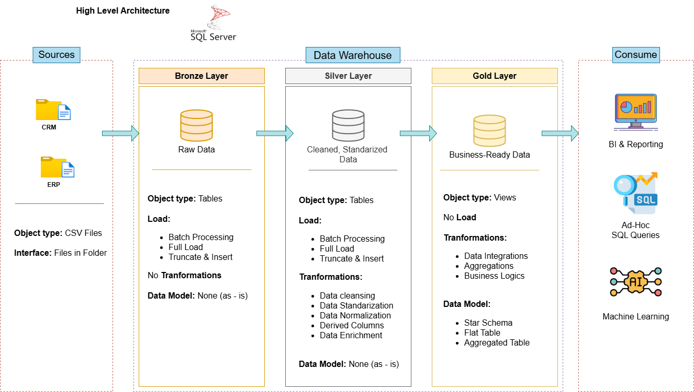
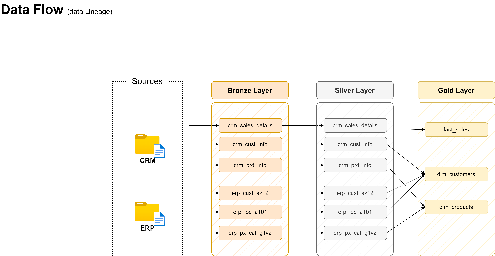
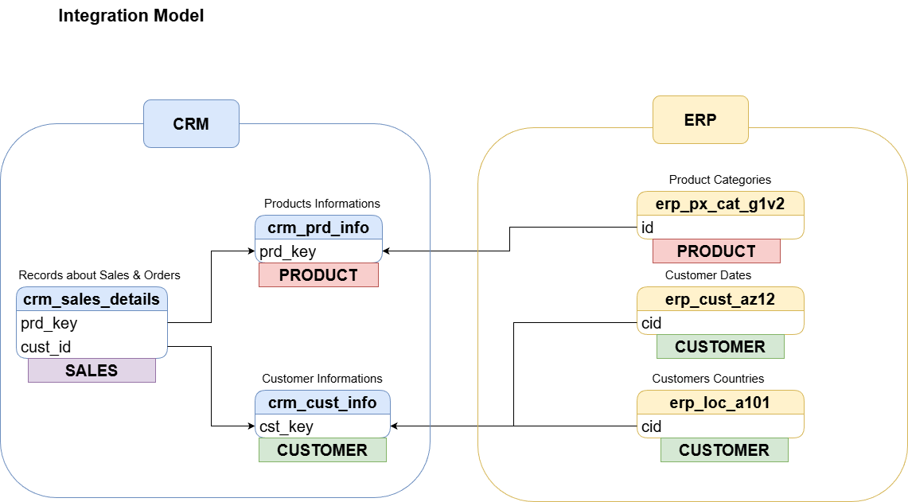

# 📊 Data Warehouse & Analytics Project

Welcome to the **Data Warehouse and Analytics Project** repository!
This project showcases an end-to-end data solution — from raw data ingestion to actionable business insights.

🚀 Designed as a portfolio project, it highlights **industry best practices** in:

* Data Engineering
* Data Modeling
* Business Intelligence & Analytics

---

## 🧠 Project Overview

This project demonstrates how to:

* Build a modern **Data Warehouse**
* Transform raw data into a **clean analytical model**
* Generate **insightful reports using SQL**

---

## ⚙️ Data Warehouse (Data Engineering)

### 🎯 Objective

Develop a modern data warehouse using **SQL Server** to consolidate sales data and support analytical reporting.

### 📌 Specifications

* 📥 **Data Sources**
  Import data from two systems:

  * ERP (Enterprise Resource Planning)
  * CRM (Customer Relationship Management)

* 🧹 **Data Quality**
  Clean and standardize raw data before analysis.

* 🔗 **Integration**
  Merge both sources into a unified, analytics-friendly data model.

* 📊 **Scope**
  Focus on the latest dataset (no historization required).

* 📚 **Documentation**
  Provide clear and accessible data model documentation for:

  * Business stakeholders
  * Analytics teams

---

## 📈 BI: Analytics & Reporting

### 🎯 Objective

Develop SQL-based analytics to generate meaningful business insights.

### 🔍 Key Analysis Areas

* 👥 **Customer Behavior**
  Understand purchasing patterns and segmentation.

* 📦 **Product Performance**
  Identify top-performing and underperforming products.

* 📉 **Sales Trends**
  Analyze revenue trends over time.

---

## 💡 Business Value

These insights help stakeholders:

* Make **data-driven decisions**
* Identify **growth opportunities**
* Improve **operational efficiency**

---

## 🛠️ Tech Stack

* 🗄️ SQL Server
* 🧮 T-SQL
* 📄 CSV Files
* 📊 Data Modeling (Star Schema)

---

## 📸 Project Preview

### 🏗️ Data Architecture

This diagram illustrates the overall architecture of the data pipeline, from raw data sources to the analytics layer.

---

### 🔄 Data Flow

Shows how data moves through the system, including ingestion, transformation, and loading processes.

---

### 🔗 Data Integration

Represents how ERP and CRM data are combined into a unified structure.

---

### 🧩 Data Model (ERD)

This diagram represents the star schema used to optimize analytical queries and reporting.

---

## 🧠 Design Decisions

* Designed a layered architecture separating data ingestion, transformation, and analytics
* Used a star schema to optimize analytical queries and performance
* Integrated ERP and CRM data into a unified model for better business insights
* Focused on the latest dataset to simplify the pipeline and reduce complexity

---

## 🚀 How to Run

1. Import CSV files into SQL Server
2. Run data integration and cleaning scripts
3. Build the data warehouse schema
4. Execute analytical queries to generate insights

---

## 📄 License

This project is licensed under the **MIT License**.
You are free to use, modify, and share this project with proper attribution.

---

## 🙌 About Me

Hi! I'm an aspiring data analyst with a strong interest in data engineering and analytics.

I enjoy working with data — from cleaning and transforming it to uncovering useful insights.
Through projects like this, I'm building my skills in:

* SQL and data querying
* Data modeling
* Analytical thinking

I'm continuously learning and looking for opportunities to grow in the data field.

📫 Feel free to connect or reach out!
